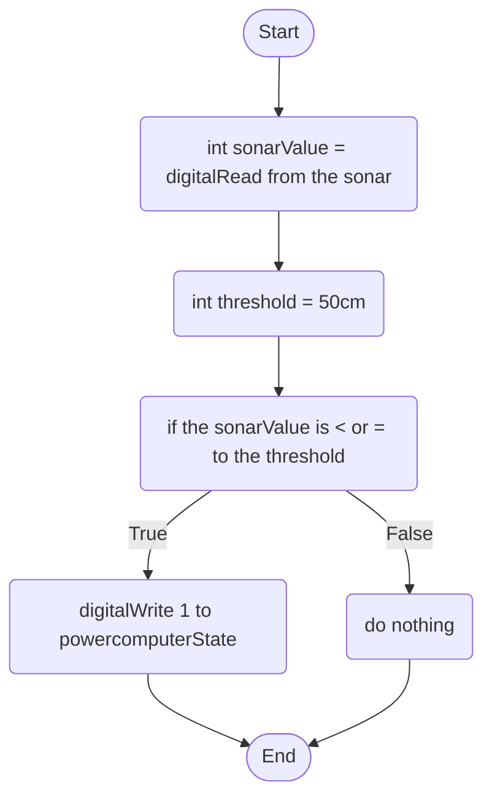

Sonar Behaviour: The sonar will detect a human coming close to the computer, if there is a person within a certain threshold of the sonar range, it will start the boot-up process of the computer, otherwise, the process ends.

