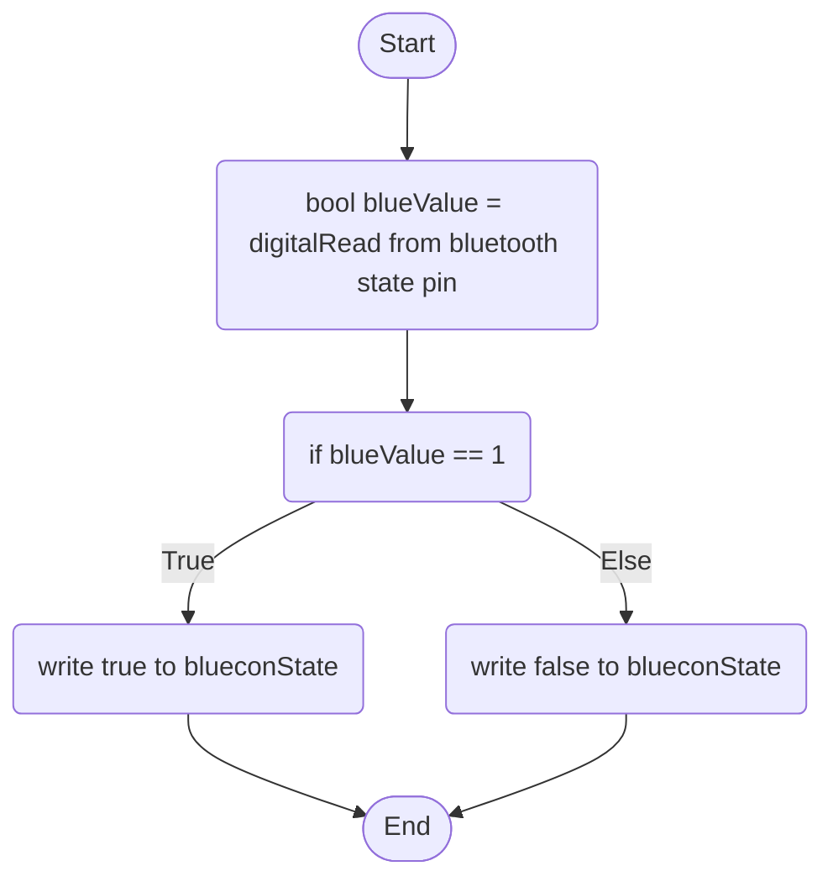

Bluetooth Behaviour: This acts as authentication to automate the login process when the Bluetooth module detects the user's phone, tablet, laptop or even smartwatch within a certain threshold, it will automatically unlock the user's computer, otherwise, it will stay locked.

blueconState is a boolean global variable that stores the bluetooth module's connection state; whether it is paired with a device or not.

