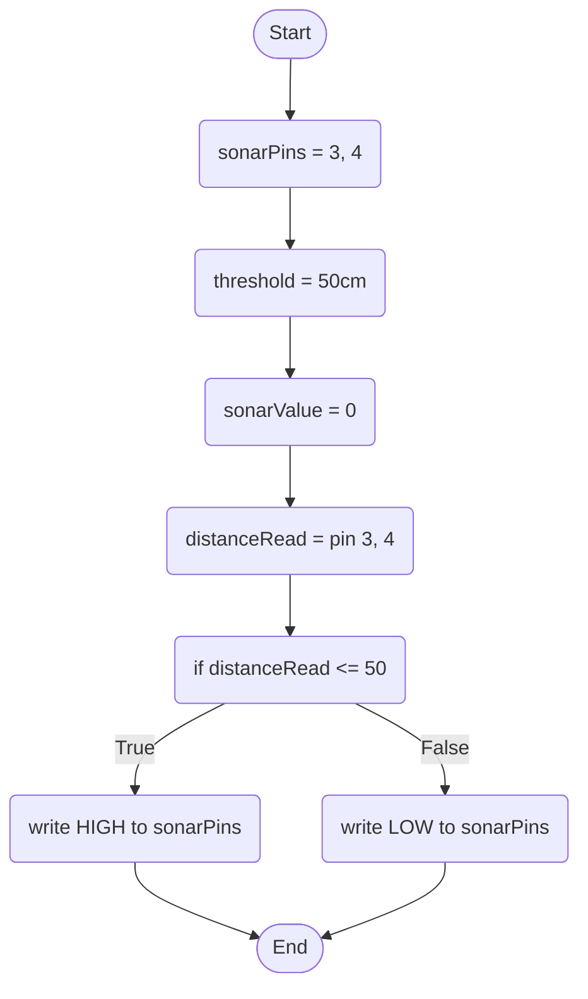

Bluetooth Behaviour: This acts as authentication to automate the login process, when the bluetooth module detects the users phone, tablet, laptop or even smart watch within a certain threshold, it will automatically unlock the users computer, otherwise it will stay locked.

