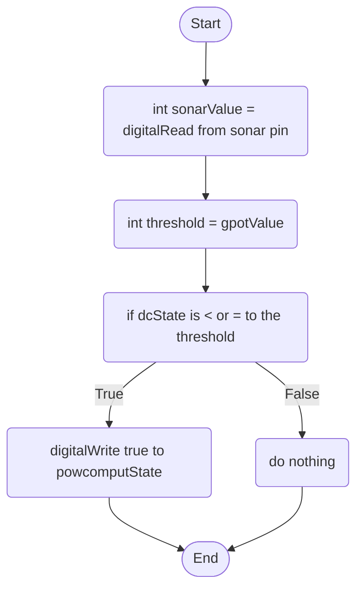

DC Motor Behaviour: This motor will attach to the back of any monitor or computer case and will hold a bottle on top of it, once the user presses the button, the DC motor will bring the bottle forward and when the user presses the button again, it will put the DC motor back to its original position.

