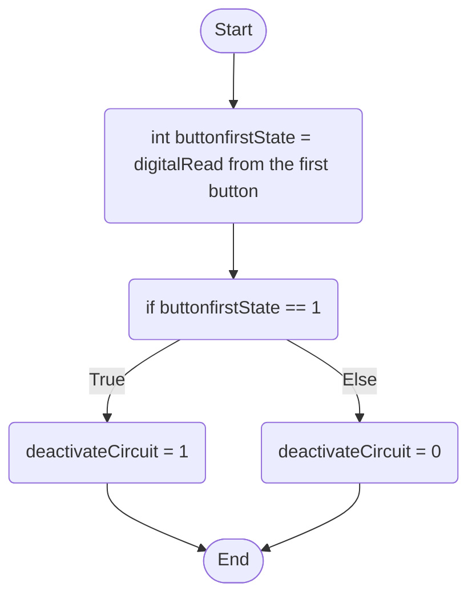

First Button Behaviour: When the user is away or does not want the circuit to function, when the button is pressed, it will deactivate all of the whole circuit, if it is pressed again, the circuit will re-activate the circuit and let it function as normal.

