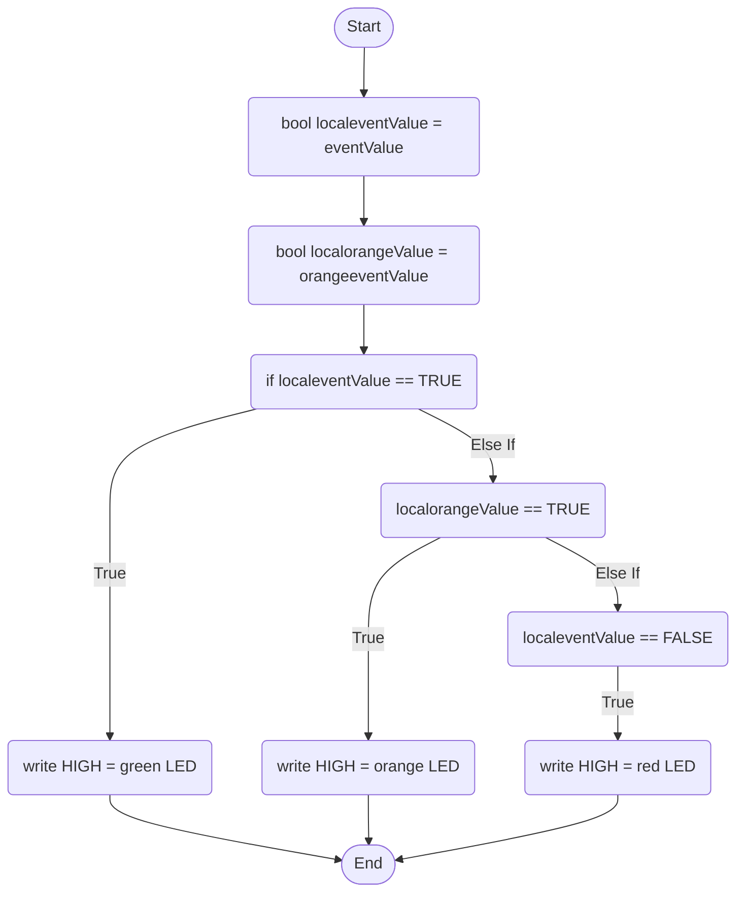

Light Module Behaviour: This light module consists of three LEDs, one being red, orange and green. When an input has been triggered, the green light will turn on, otherwise, the light will be off. The orange light will turn on when an event has been triggered previously and no other event is currently happening, a standby LED. Finally, the red light will trigger when the circuit has been turned on and there have not been any events triggered. 

eventValue is a global boolean variable that stores if an event is running or not

orangeeventValue is another global boolean variable that stores if an event has been run in the last five seconds.

