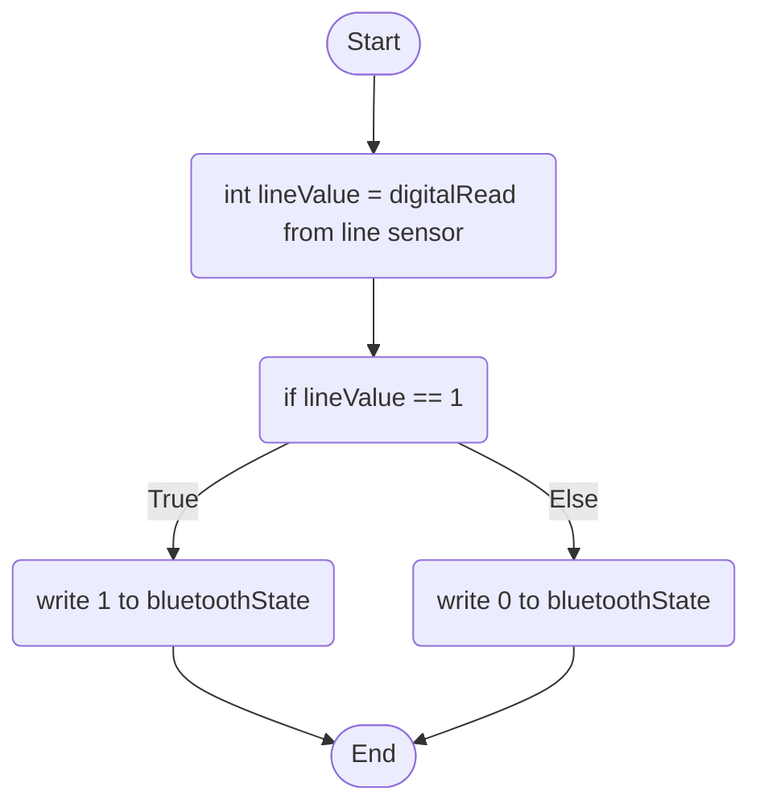

Line Sensor Behaviour: To further automate the boot-up and login process for the end-user; if the line sensor detects someone on the seat, it will send a message to activate the Bluetooth module and set it to sniff mode; Otherwise the sensor will do nothing.

