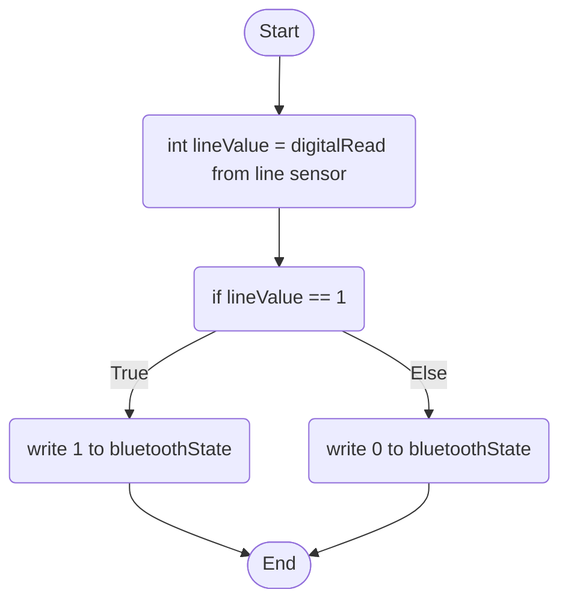

The program's layout: There will be two main loops that the program will loop through, the first loop, void loop(), will hold all of the functions that need to constantly be checked like the sonar function; it will mostly hold all of the input functions. After that is the void main() loop, which will mainly store the output functions as the data required for these functions are created in the input functions. 

