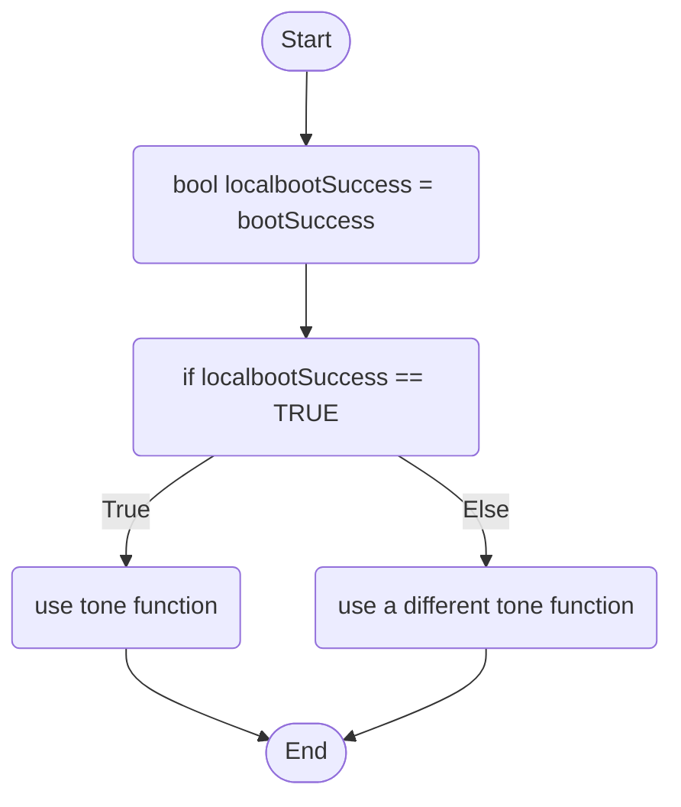

Piezo Behaviour: The buzzer will output a tone when the circuit is successfully turned on, if not successful an alternate tone will play. It will check the integrated LED on the Arduino UNO to determine if the ‘boot’ is successful.

bootSuccess is a global boolean variable that stores whether the 'boot' process of the Ardiuno UNO has been completed.

