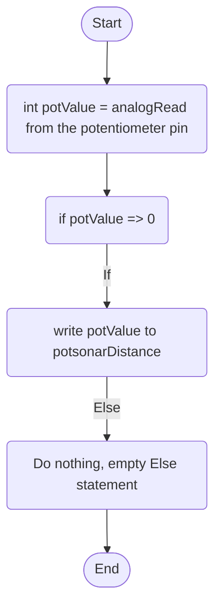

Potentiometer Behaviour: The purpose of this is to be able to quickly and granularly change the distance in which the sonar sensor triggers, if the potentiometres value is set to 1024, it will set the trigger distance to 1024 in cm.

