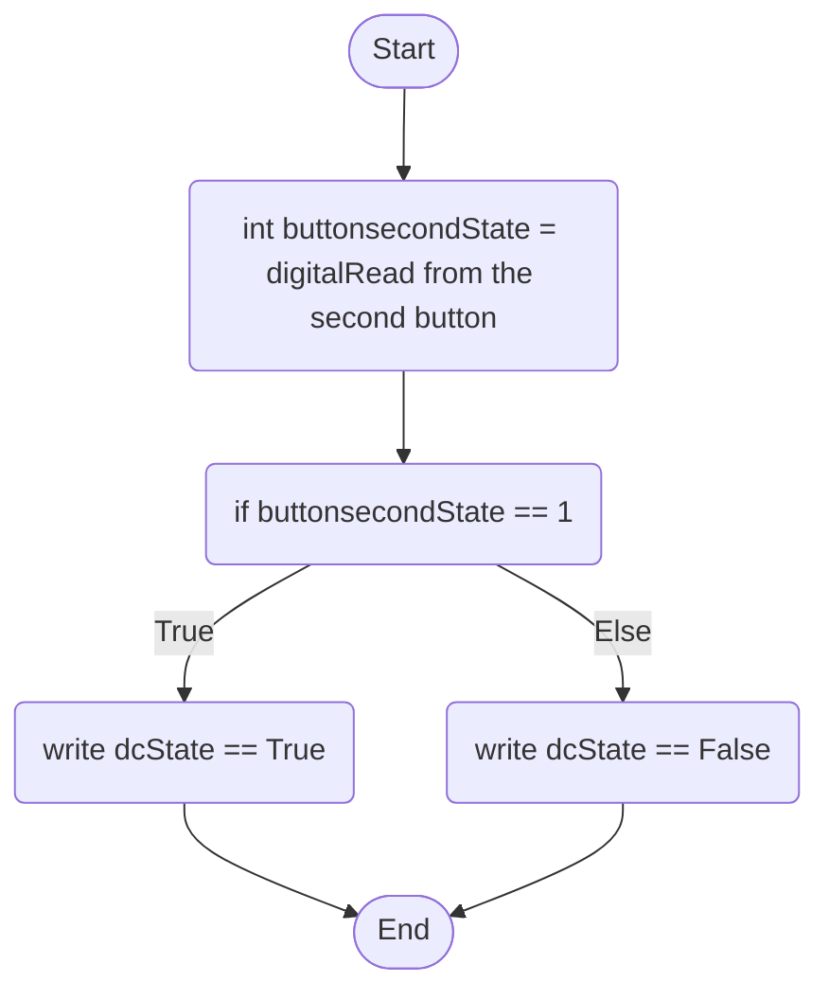

Second Button Behaviour: The second button will act as an on and off switch for the DC Motor; one push will turn it off, once it is pushed again it will reactivate the DC Motor.

dcState is another global variable that stores a boolean to be used in the DC motor function to turn it on or off.

