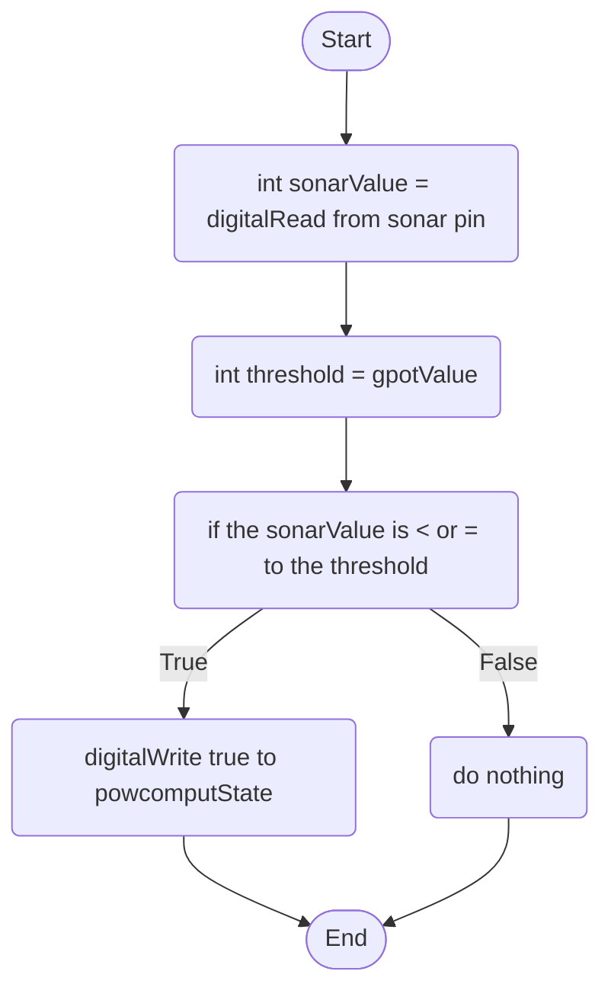

Sonar Behaviour: The sonar will detect a human coming close to the computer, if there is a person within a certain threshold of the sonar range, it will start the boot-up process of the computer, otherwise, the process ends.

gpotValue is a global variable that holds the potientiometres value it is currently set; see in the potientiometre flowchart.

powcomputState is another global variable that is a boolean and it stands for power computer state; this would be used for turning the computer.

