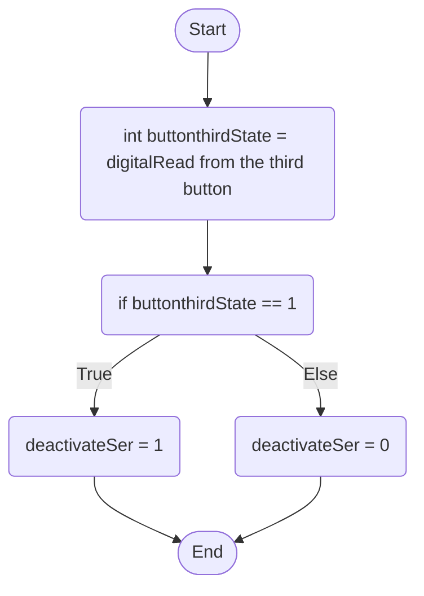

Third Button Behaviour: The third button will act as an on and off switch for the Servo Motor. One push will turn it off and pushing it again will turn it back on. 

```mermaid
flowchart TD
terminalStart([Start])
terminalEnd([End])
setbuttonValue(int buttonthirdState = digitalRead from the third button)
activateButton0(if buttonthirdState == 1)
activateButton1(deactivateSer = 1)
activateButton2(deactivateSer = 0)
   
terminalStart --> setbuttonValue
setbuttonValue --> activateButton0
activateButton0 --> |True| activateButton1
activateButton0 --> |Else| activateButton2
activateButton1 --> terminalEnd
activateButton2 --> terminalEnd
```
