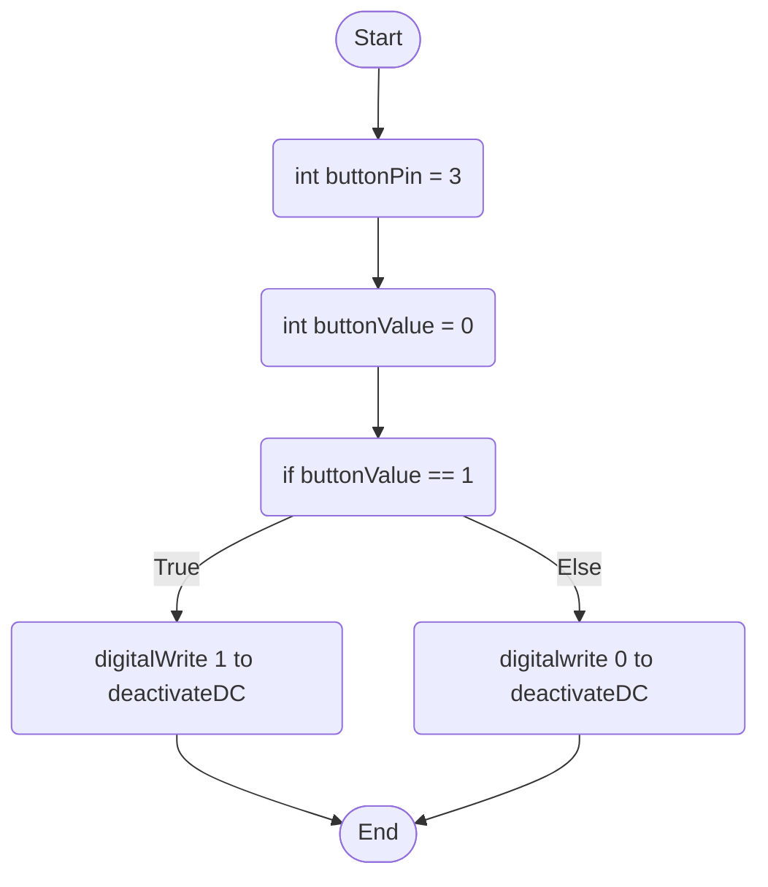

Third Button Behaviour: The third button will act as an on and off switch for the Servo Motor; when the button is being held, the motor will push will turn it off, once it is pushed again it will reactivate the DC Motor.

