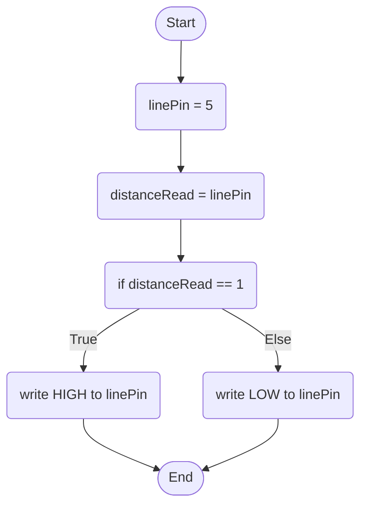

Line Sensor Behaviour: When the line sensor detects someone on the seat, it will trigger the events that authenticate that it is the correct user is on the seat, like a bluetooth connection, otherwise all of the sensors besides the sonar will stay deactivated.

