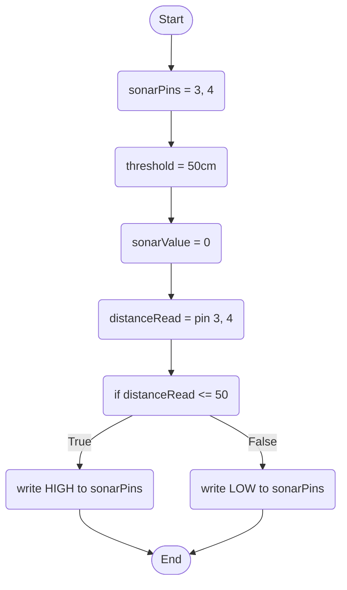

Sonar Behaviour: When the sonar sensor detects a human coming close to the computer, it will start the boot up process, otherwise it will keep the computer off.

```mermaid
flowchart TD
terminalStart([Start])
terminalEnd([End])
setSonarPins(sonarPins = 3, 4)
setThreshold(threshold = 50cm)
createSonarValue(sonarValue = 0)
currentValue(distanceRead = pin 3, 4)
activateSonar0(if distanceRead <= 50)
activateSonar1(write HIGH to sonarPins)
activateSonar2(write LOW to sonarPins)

terminalStart --> setSonarPins
setSonarPins --> setThreshold
setThreshold --> createSonarValue
createSonarValue --> currentValue
currentValue --> activateSonar0
activateSonar0 --> |True| activateSonar1
activateSonar0 --> |False| activateSonar2
activateSonar1 --> terminalEnd
activateSonar2 --> terminalEnd
```
